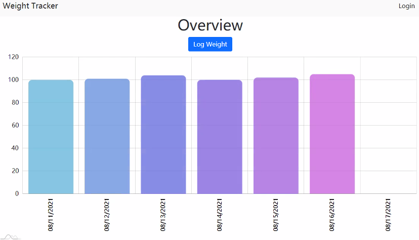

# Project #2 - DTRS Weight Tracker

## Weight Tracker web-app lets users login and see their weight posts. Their profile shows an interactive chart with their past weight. Users can select any time interval to display their weight

## Additionally, once items are in the shopping list, and API call returns the best wines that pair well with each item. The user can see suggestions from "The god of wine" based on what is in their shopping list. The user can also click on each item to get some of its nutrition facts (cal, fat, carbs).

### Technologies used:

- Amcharts
- express
- node
- Sequelize
- Handlebars
- Bootstrap

### Team:

- Sergey - Back-end
- Casey - Front-end
- Tho
- Richard

### Future Development

- Fix bugs (connecting front <> backend)
- Add Calorie/food intake tracking
- Add ability to upload before and after pictures
